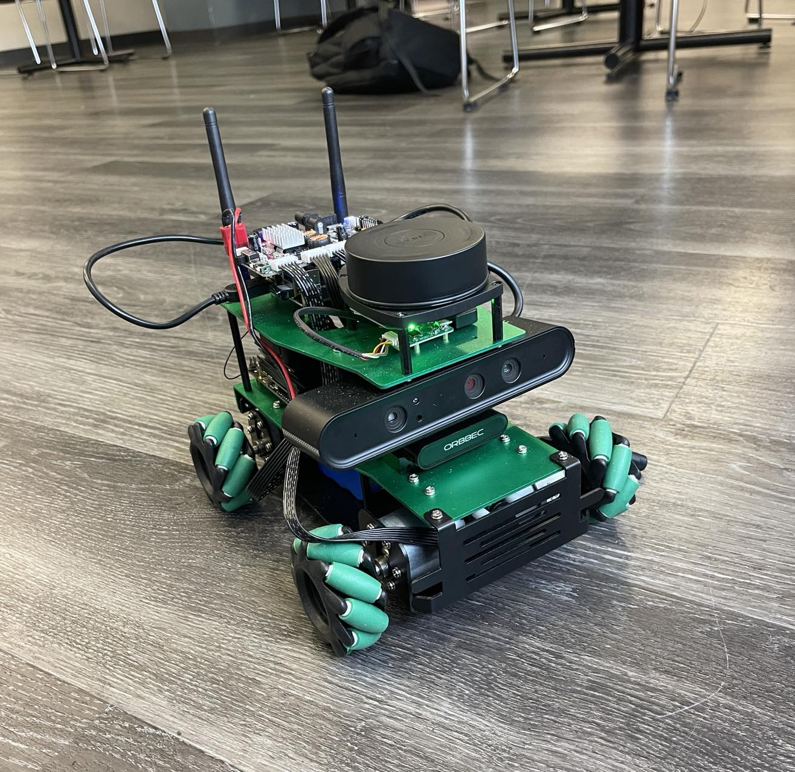
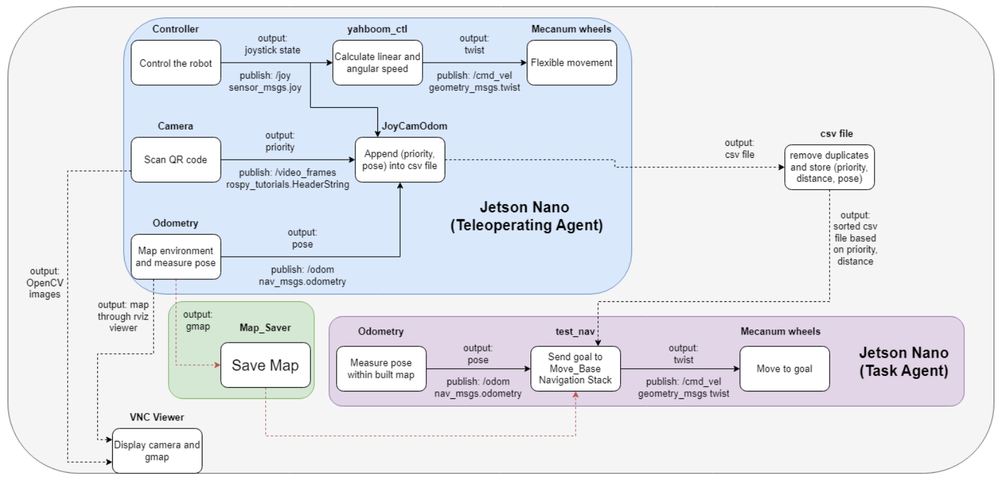

# Path-guiding Multi-agent Robotic System
This is a multi-agent robotic system. The system consists of a Teleoperating Agent which is used to map the environment and locations of QR codes, and a Task Agent which is used to go the available QR code with highest priority.

## Project Motivation & Scenarios
A parking lot hosting both electric and non-electric vechicles. There are electrical cars that autonomously navigate to their desired destination from their current locations. Commonly, vehicles are usually park into a parking lot. Additionally, electric vehicles would prefer to be park at a spot where there consist of a charging station. Therefore, creating a path guiding robot system to communicate the best spot towards the electric vehicle to park would help reduce the time complexity for the autonomous electric vehicle to find the optimal spot within the parking lot.

Scenarios Details:
    The non-electric vehicles are considered as virtual obstacles occupying parking spots. 
    Priority 1 is virtually simulated to be a parking spot consisting of nearby available charging electrical station.
    Priority 2 is virtually simulated to be a normal parking spot without any nearby available charging electrical station.  

## Design Diagram

  

## How to Run?
### Phase One
In phase one, we will control the Teleoperating Agent to map the environment, and record the locations of QR codes by pressing button A on the controller.

To run phase one, first go to the `root` directory and run `roslaunch launch/first_phase.launch`

Mark the initial location of the robot. The command will open gmap and the camera of the robot. Navigate the robot through the environment and go to each QR code, the ideal distance from the robot to each QR code should be around 15-20cm so that the robot won't label the QR code as an obstacle and tries to avoid it. When the camera has shown a clear image of the QR code and display its priority, press button A to save the priority and current location of the robot (as well as the QR code) into `data.csv`. The file will have 8 columns: <i>priority, position_x, position_y, orientation_x, orientation_y, orientation_z, orientation_w, time</i>.

After scanning all QR codes, open a new terminal and run `rosrun map_server map_saver -f ~/CPS_ws/src/QR_Camera_Dist/maps/map_name` to save the map. Then terminate the launch of phase one. Open `data.csv` to ensure that all QR codes are saved, there will be some duplicates in the file, but we will remove them in phase two.

### Phase Two
In phase two, the Task Agent will go to the available QR code with highest priority.

To run phase two, first put the robot in its initial location. Then go to the `root` directory and run `roslaunch launch/second_phase.launch map:=map_name`.

The command will open gmap. Then run `rosrun QR_Camera_Dist test_nav.py` to start phase two. This command will prompt us to input a list of QR codes that we want to block. Before enter the list, go to `test_data.csv` which is the list of QR codes with: <i>priority, distance, position_x, position_y, orientation_x, orientation_y, orientation_z, orientation_w</i> that we already remove the duplicates using pandas dataframe based on <i>time</i>, check the row number of each QR code. The QR codes are sorted in decreasing order of priority in which <i>priority 1</i> is the highest, so all QR codes with <i>priority 1</i> will be put on top, and in each priority, different QR codes are sorted in increasing order of distance to the initial location.

After enter the list of blocked QR codes, the robot will ignore the blocked QR codes and go to the first available QR code in `test_data.csv` file, then it will output `Goal Execution Done!` and stop.

## Main Software Artifacts Contributions

### JoyCamOdom.py

Packages:
    rospy               : ros functions in python
    csv                 : append informations into csv file
    message_filters     : approximate synchronization of multiple subscribe topics to be used in one callback function
    time                : remove duplicates through comparison
    std_msgs.msg        : receive string data
    nav_msgs.msg        : receive Odometry data
    sensors_msgs.msg    : receive Joy data
    rospy_tutorials.msg : receive HeaderString data

Within the main function, the node CamJoyOdom subscribe to three topics namely joy, odom, videos_frames (camera). To subscribe to these topic to use in one callback function, a package called "message_filters" and its imported function called "ApproximateTimeSynchronizer" are used. Before calling the callback function, a csv file, located within the current working directory, has opened to write "priority,posx,posy,orix,oriy,oriz,oriw,time" as categories into the file, to remove previous collections of old data and to be compatible with pandas dataframes function. 

Within the callback function called "buttonCallBack", it receives data from subscribe topics to be used to essentially append the information about the pose of the robot and the priority about the parking location. When the button A on the controller has been pressed, it will open the same csv file to append the pose of the robot at each QR code locations into the csv file. Additionally, the controller will also append a time to essentially remove duplicates, consisting of the same informations of each QR code. 

### main.py
<b>webcam()</b> fuction opens the camera through the path `/dev/video`. When a QR code is detected, it will read the priority of the QR code, and publish the priority to `video_frames` as a <i>HeaderString</i>. In display we can see also see that the QR code is wrapped around by purple lines with its priority on top.

## Video Demo
[Link to video demo](https://drive.google.com/file/d/1WP3eAxKgsKSg2fDq-870fyxHzeAvRwC-/view?usp=sharing).